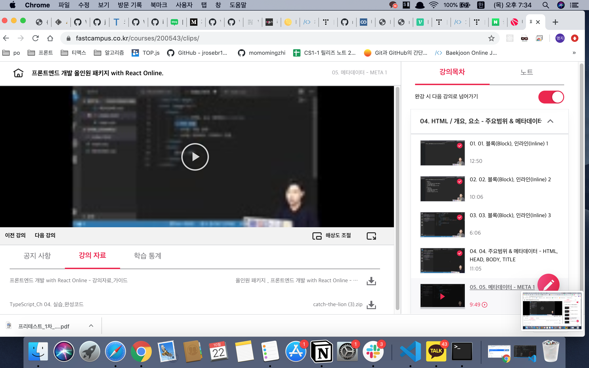
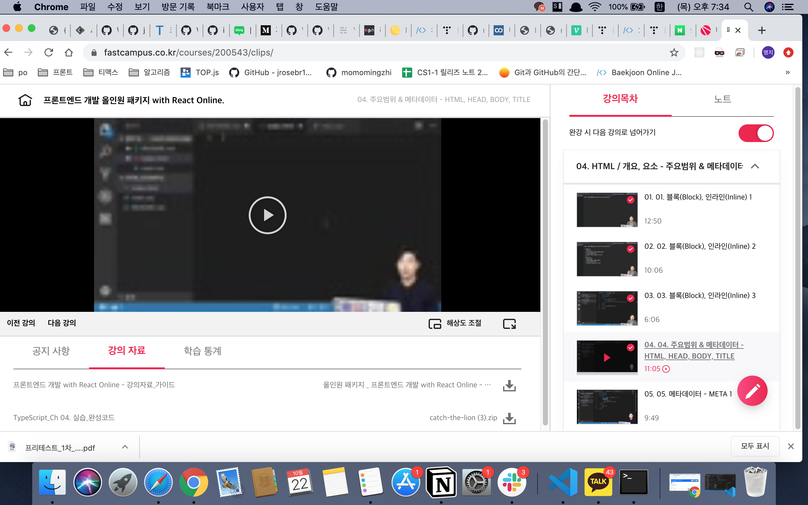
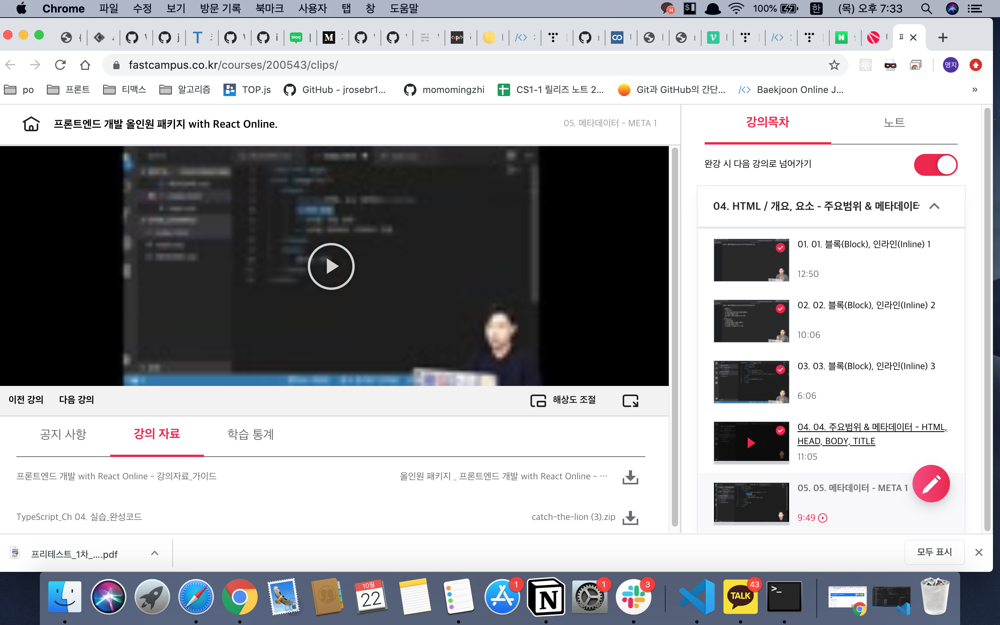

## 프론트엔드 인강 4일차
### 03.03 블록 인라인3
span은 인라인 요소인데 display:block을 써서 block으로 강제로 바꿀 수 있어
display는 요소의 특성 선택하는 속성
inline -> block
block -> inline
``` css
 {display: none} // 박스가 생성되지 않음 곧 자리 차지 하지 않는다
 {display: inline-block} //inline 인데 내부는 block 처럼 표시 박스 모양이 inline처럼 옆으로 늘어섬
```
div h1 p 는 디폴트 값으로 
``` css
    div {display: block;}
    h1 {display: block;}
    p {display: block;}
```

``` css
span {display: inline;}
```

### 04.04 주요 범위 & 메타 데이터 HTML, HEAD , BODY, TITLE
html 내에서 해석하지 밖에 있는 내용은 확인하지 않음
html은 Language 를 작성할 수 있어
웹페이지 본문에는 보이지 않으며, 브라우저의 탭 등에서 확인 할 수 있dma.
유저에게 문서의 제목을 알리는 용도 뿐만 아니라,
검색 엔진 등에서 가장 크게 보여지는 텍스트이므로 페이지의 특성을 드러내는 제목을 작성하는 것이 중요
``` html
<html lang="en"> // ko 로 바꾸면 한국어 작성 가능

```
국가표시와 언어 표시는 다름
``` html
<!DOCTYPE html> //이 문장의 이하는 html 5로 작성하겠다 document의 타입이 무엇인지 명시해주기
<html lang="ko"> // ko 로 바꾸면 한국어 작성 가능
   <head>
    문서의 정보
    html 문서의 제목 <title> </title>
    기타 정보
    스타일을 직접 입력할 수 있음
    스타일을 외부에서 가져와서 연결
    </head>
    <body>
        문서의 구조
    <body>
</html>
```



[링크](https://bit.ly/3m0t8GM)