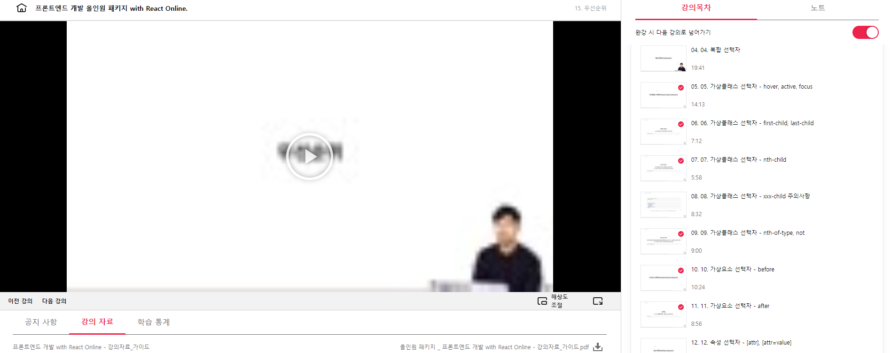
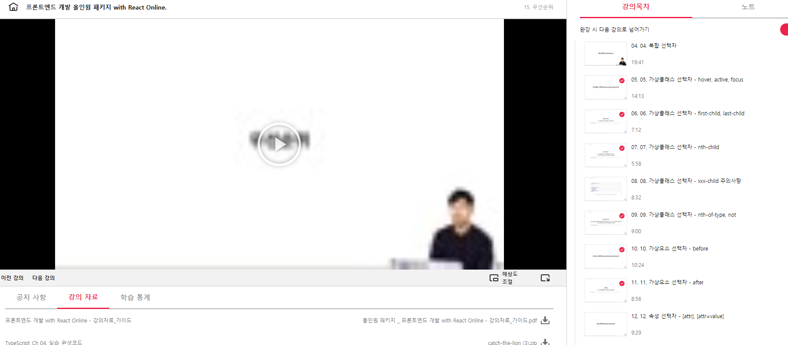
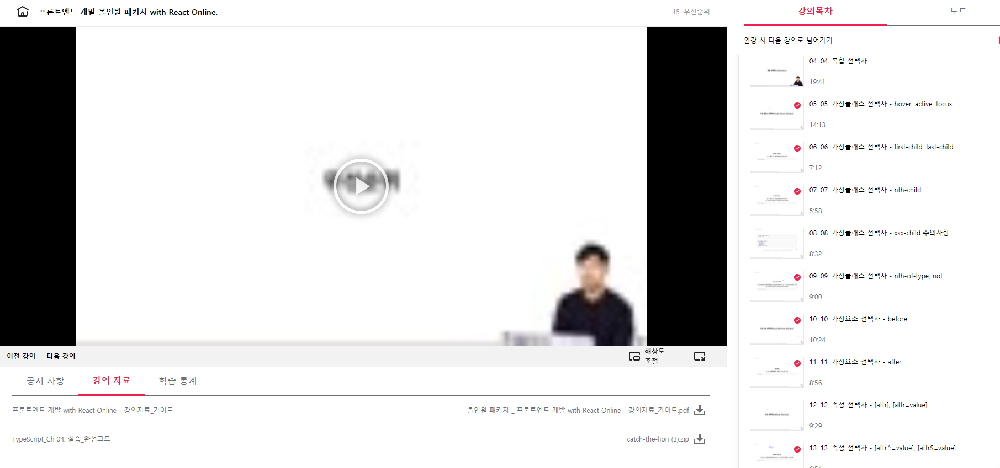

## 프론트엔드 인강 41일차

### sass extend

특정 선택자가 다른 선택자의 모든 스타일을 가져야하는 경우가 종종 있습니다.
이럴 경우 선택자의 확장 기능을 사용할 수 있습니다.
다음 예제를 봅시다.

```
@extend 선택자;

```

- scss

```
.btn {
  padding: 10px;
  margin: 10px;
  background: blue;
}
.btn-danger {
  @extend .btn;
  background: red;
}
```

- compiled to

```css
.btn,
.btn-danger {
  padding: 10px;
  margin: 10px;
  background: blue;
}
.btn-danger {
  background: red;
}
```

```
.btn{
   padding: 10px;
  margin: 10px;
  background: blue;
}
.btn-danger{
    //또 작성하기가 귀찮으니까
    @extend .btn;
    //이거 없애면 아래처럼 .btn .btn-danger{} 될 수 없어
}

.btn .btn-danger{
    padding: 10px;
  margin: 10px;
  background: blue;
}
.btn-danger{
    background:red;
}
```

컴파일된 결과가 마음에 드시나요?  
결과를 보면 ,로 구분하는 다중 선택자(Multiple Selector)가 만들어졌습니다.

사실 @extend는 다음과 같은 문제를 고려해야 합니다.

내 현재 선택자(위 예제의 .btn-danger)가 어디에 첨부될 것인가?

- 이런식으로 동작하다보니 내가 원하지 않는 문제점 생길수도 있어
  원치 않는 부작용이 초래될 수도 있는가?
- 선택자가 길어질수도 있어
  이 한 번의 확장으로 얼마나 큰 CSS가 생성되는가?  
  결과적으로 확장(Extend) 기능은 무해하거나 혹은 유익할 수도 있지만 그만큼 부작용을 가지고 있을 수 있습니다.  
  따라서 확장은 사용을 권장하지 않으며, 위에서 살펴본 Mixin을 대체 기능으로 사용하세요.

```
.contaner{
    width:300px;
    .item{
        width:200px;
    }
    .icon{
        width:100px;
    }
}
.new-icon{
    @extend .icon
}
.wrapper{
    .new-icon{
        @extend .icon;
    }
}

//결과
.container .item .icon, .contaier .item .new-icon{
    width:100px;
    선택자 부분이 이상하게 바뀌어버림
}

.container .item .icon, .contaier .item .wrapper .new-icon,wrapper .item .new-icon{
    width:100px;
    앞에 존재하는 조상선택자들이 전혀 의도하지 않은대로 만들어져버림
}
```




[링크](https://bit.ly/3m0t8GM)
