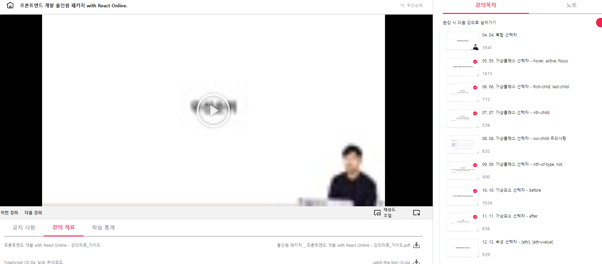

## 프론트엔드 인강 42일차

### sass 함수

자신의 함수를 정의하여 사용할 수 있습니다.
함수와 Mixins은 거의 유사하지만 반환되는 내용이 다릅니다.

Mixin은 위에서 살펴본 대로 지정한 스타일(Style)을 반환하는 반면,
함수는 보통 연산된(Computed) 특정 값을 @return 지시어를 통해 반환합니다.

```
// Mixins
@mixin 믹스인이름($매개변수) {
  스타일; //믹스인은 내부에서 스타일을 처리함
}

// Functions
@function 함수이름($매개변수) {
  @return 값 //함수가 처리하는건 특정한 값 특정값을 재활용 하기 위해서
}
```

```
// Mixin
@include 믹스인이름(인수);

// Functions
함수이름(인수)
```

- scss

```
$max-width: 980px;

@function columns($number: 1, $columns: 12) {
  @return $max-width * ($number / $columns)
}

.box_group {
  width: $max-width;

  .box1 {
    width: columns();  // 1
  }
  .box2 {
    width: columns(8);
  }
  .box3 {
    width: columns(3);
  }
}

```

- compiled to

```css
.box_group {
  /* 총 너비 */
  width: 980px;
}
.box_group .box1 {
  /* 총 너비의 약 8.3% */
  width: 81.66667px;
}
.box_group .box2 {
  /* 총 너비의 약 66.7% */
  width: 653.33333px;
}
.box_group .box3 {
  /* 총 너비의 25% */
  width: 245px;
}
```

내장함수와 이름이 중복될 수 있음

```
내장 함수란, 응용 프로그램에 내장되어 있으며 최종 사용자가 액세스 할 수 있는 기능입니다.
예를 들어, 대부분의 스프레드 시트 응용 프로그램은 행이나 열의 모든 셀을 추가하는 내장 SUM 함수를 지원합니다.
```

내장 함수란, 응용 프로그램에 내장되어 있으며 최종 사용자가 액세스 할 수 있는 기능입니다.  
예를 들어, 대부분의 스프레드 시트 응용 프로그램은 행이나 열의 모든 셀을 추가하는 내장 SUM 함수를 지원합니다.

```

// 내가 정의한 함수
@function extract-red($color) {
  // 내장 함수
  @return rgb(red($color), 0, 0);
}

div {
  color: extract-red(#D55A93);
}
```




[링크](https://bit.ly/3m0t8GM)
