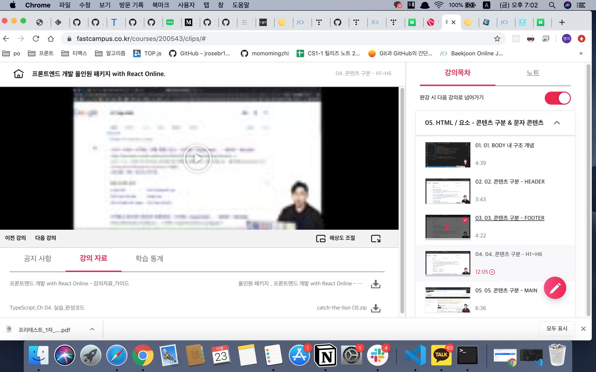

## 프론트엔드 인강 5일차
### HEADER
HTML <header> 요소는 소개 및 탐색에 도움을 주는 콘텐츠를 나타냅니다. 제목, 로고, 검색 폼, 작성자 이름 등의 요소도 포함
``` html
<header class="page-header">
    <h1>Cute Puppies Express!</h1>
</header>

<main>
    <p>I love beagles <em>so</em> much! Like, really, a lot. They’re adorable and their ears are so, so snuggly soft!</p>
</main>

```
<header> 요소는 구획 콘텐츠가 아니므로 개요에 구획을 생성하지 않음. 대신 주위 구획의 제목(<h1>-<h6> 요소)을 감싸기 위한
요소를 사용한다
``` html
<header>
    <header>
        //안됨
    </header>
    <footer>
        //안됨
    </footer>
</header>

### FOOTER
<footer> 태그는 문서나 특정 섹션(section)의 푸터(footer)를 정의할 때 사용.

 

푸터(footer)는 보통 <footer> 요소가 포함되어 있는 문서나 섹션에 대한 아래와 같은 정보를 포함.

- 저자(author) 정보

- 저작권 정보

- 연락처

- 사이트맵(sitemap)

- 페이지 맨 위로 되돌아갈 수 있는 Top 버튼

- 연관 페이지 등

``` html
<footer>
    <p>Copyright © 2018 tcpschool.co.,Ltd. All rights reserved.</p>
    <address>Contact webmaster for more information. 070-1234-5678</address>
</footer>
```

```html
<!DOCTYPE html>
<html>
<head>
<meta charset="utf-8" />
<title>footer 태그</title>
</head>
<body>
    <footer>
        <div id="serviceNameArea">
            <a href="/">
                <h2>(주)에버디벨</h2>
            </a>
        </div>
        <ul>
            <li>회사소개</li>
            <li>개인정보보호정책</li>
            <li>위치</li>
            <li><a href='tel:010-XXXX-XXXX'>고객센터</a></li>
        </ul>
        <address>주소: 서울특별시 마포구 아현동 백범로</address>
    </footer>
</body>
</html>
```



[링크](https://bit.ly/3m0t8GM)