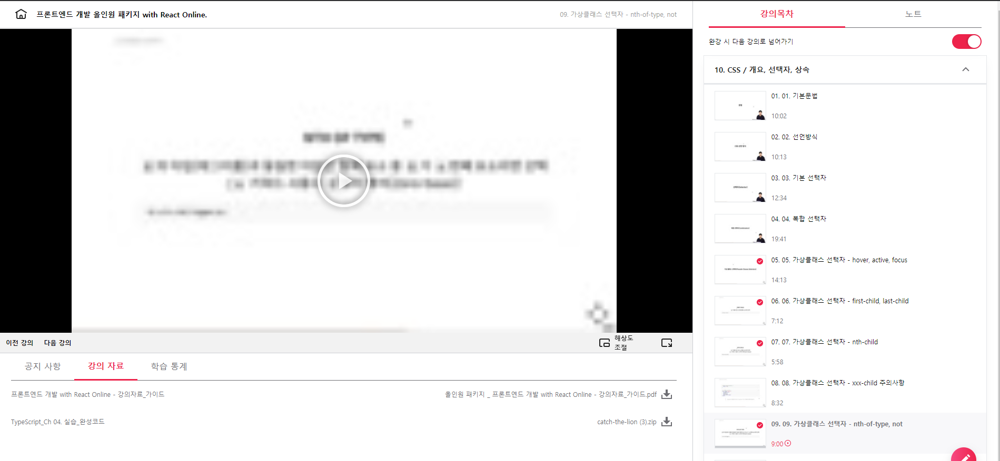

## 프론트엔드 인강 7일차

### nth-child

- Nth child
  E가 형제 요소 중 n 번째 요소하면 선택(n 키워드 사용시 0부터 해석)
  `E:nth-child(n)`

```html
<ul calss="fruit">
  <li>딸기</li>
  <li>딸기</li>
  <li>딸기</li>
</ul>
```

```css
.fruit li:nth-child(2) {
  color: red;
}
.fruit li:nth-child(2n) {
  // 0 2 4 6 ... 이렇게 사용 0 이나 4는 지금 없으니까 선택되지 않음 짝수번째 태그들 선택할때 이런식으로
  color: red;
}
//3번쨰 요소부터 이후 요소들을 선택하고 싶을때?
.fruit li:nth-child(n + 3) {
  //3 4 5 6 ....
  color: red;
}
```

- Nth of type
  E의 타입(태그 이름)과 동일한 타입인 형제 요소 중 E가 n번째 요소라면 선택 n 키워드 사용시 0 부터 해석
  `E:nth-of-type(n)`

```html
<ul calss="fruit">
  <div>딸기</div>
  <p>사과</p>
  <p>망고</p>
</ul>
```

```css
//3번쨰 요소부터 이후 요소들을 선택하고 싶을때?
.fruit p:nth-of-type(1) {
  color: red; //사과 선택 p태그 중에서 첫번째 꺼다! type은 태그를 의미함
}
```

```html
<ul calss="fruit">
  <li>딸기</li>
  <li class="red">사과</li>
  <li class="red">오렌지</p>
</ul>
```

```css
사과를 선택하고 싶을때?
.fruit .red:nth-of-type(1) {
  color: red;  //type자체가 태그의 이름이라고 선택함 red 가진건 것의 태그 이름은 li  여기서 타입은 li
  li 의 첫번째로서는 딸기를 선택할텐데 딸기는 red라는 class를 가지고 있지 않기 때문에 아무것도 선택되지 않음
  이렇게 class와 혼동해서 사용하면 안됨
}
```

- 부정 선택자
  S가 아닌 E 선택
  `E:not(s)`
  E를 찾는데 S를 빼고 선택하겠다.

```html
<ul calss="fruit">
  <li>딸기</li>
  <li class="apple">사과</li>
  <li>오렌지</p>
</ul>
```

사과만 빼고 글자색을 red로 바꾸고 싶다!

```css
.fruit li {
  color: red;
}

이렇게 바꾸면 됨 .fruit li:not(.apple) {
  color: red; //사과만 빨간색에서 빼겠다 이런식으로 부정선택자 사용
}
```




[링크](https://bit.ly/3m0t8GM)
