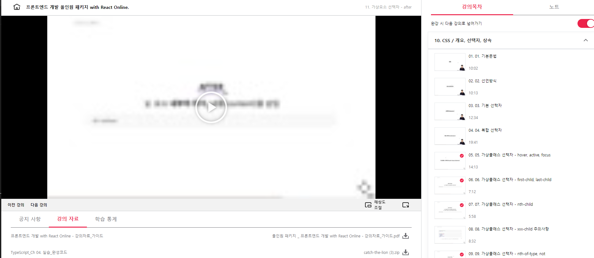

## 프론트엔드 인강 8일차

### 110.10 가상 요소 선택자 : before

Before
E 요소 내부의 앞에 내용(content)를 삽입
`E::before`
가상 클래스는 :
가상 요소는 ::

```css
div::before //div 내용 앞쪽에 요소가 생긴다
```

```html
<ul>
  <li>1</li>
  일일히 숫자를 추가하는 것은 귀찮은 일 ! 이것을 위해 before 사용
  <li>2</li>
  <li>3</li>
  <li>4</li>
</ul>
<ul>
  숫자2
</ul>
<ul>
  숫자3
</ul>
<ul>
  숫자4
</ul>
<ul>
  숫자5
</ul>

애민 문법? ul>li{숫자$}*20 -> tab 키 누르면 여러개 한번에 생김
```

```css
ul {
  font-size: 40px;
}
ul li::before {
  //li 내부의 앞 의미 가상 요소 만들어서 추가 속성 부여할 수 있어
  content: "숫자"; // 이게 중요 content라는 내용을 부여하지 않아서 어떠한 스타일도 안먹는 경우가 있음
  font-weight: bold;
  color: red;
}
ul li::before {
  content: ""; // 이게 중요 content라는 속성을 부여하지 않아서 어떠한 스타일도 안먹는 경우가 있음 content : ""와 content를 아예 안쓰는건 다른 결과 나와
  // content:"" 는 무조건 작성해야 before 이 의미 있어짐
  font-weight: bold;
  color: red;
  display: inline-block;
}
```

### 110.10 가상 요소 선택자 : after

E 요소 내부의 뒤에 내용(content) 삽입

```html
<ul>
  <li>0.1</li>
  일일히 숫자를 추가하는 것은 귀찮은 일 ! 이것을 위해 after 사용
  <li>0.2</li>
  <li>0.3</li>
  <li>0.4</li>
</ul>
<ul>
  숫자2
</ul>
<ul>
  숫자3
</ul>
<ul>
  숫자4
</ul>
<ul>
  숫자5
</ul>

애민 문법? ul>li{숫자$}*20 -> tab 키 누르면 여러개 한번에 생김
```

````css
ul{
    font-size:40px;
}
ul li::after{
    content:".0";  // 이게 중요 content라는 속성을 부여하지 않아서 어떠한 스타일도 안먹는 경우가 있음
    font-weight:bold;
    color:red;
}
'''
content에 text 뿐만 아니라 이미지도 넣을 수 있어
``` css
ul{
    font-size:40px;
}
ul li::after{
    content:url("https://.....");
    font-weight:bold;
    color:red;
}
````

```html
<div>DIV</div>
```

```css
div:before {
  //하나만 붙어있는데도 작동은 하지만 : 하나는 가상 클래스 선택자의 개념이기 때문에 정확하게 분리를 위해 :: 가 표준!
  // 기술자체는 : 하나만 작성하는걸로 나왔지만 가상 요소 개념 생기면서 :: : 나뉘게됨
  content: ">";
}
```



[링크](https://bit.ly/3m0t8GM)
