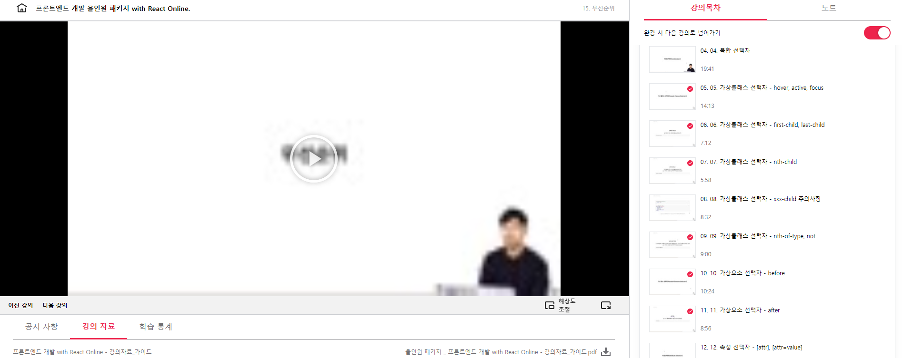

<!-- @format -->

### 패스트캠퍼스 올인원: 프론트엔드 개발 챌린지 참여 후기

패스트 캠퍼스에서 수강한 **올인원 프론트엔드 패키지**를 통해 정말 많이 배울 수 있었다. 프론트 개발자가 된지 6개월만에 기초가 부족하다는 생각이 들어 CSS부터 다시 공부해야겠다 마음을 먹었다. 어떻게 공부를 할까 고민하던차 우연히 패스트 캠퍼스에 들어와 올인원 프론트 엔드 강의가 있는 걸 봤다. 강의 커리큘럼을 보니 너무 기초부터 가르쳐서 쓸데없는 걸 하는건가에 대한 의구심이 들었다. 3일의 고민끝에 기본기를 다지기로 마음먹은 거였으니 그냥 들어보자라는 결론을 내렸다. 강의 첫날 열린 페이지를 보니 필요한 내용만 들으세요라는 문구가 있었다. 문구를 보니 이 강의는 정말 기초부터 가르치긴 하지만 정말 내가 필요한 부분만 가져갈 수도 있겠구나.. 라는 생각이 들어 열심히 듣게 되었다. 실제로 모든 게 자세하게 나뉘어져 있으니까 내가 뭘 모르고 있었는지를 알게 되었다. 나는 css를 열심히 들었는데 가상 클래스 선택자에서 first-child, last-child, nth-child, nth-of-type, not이 있다는 걸 알았고 가상 요소선택자엔 before, after가 있다는 걸 알았다. 그리고 상속에서 text 관련 요소는 상속이 된다는 걸 아니까 회사 업무에서 이슈 처리하기가 쉬어졌다. 또한 평소에 postion에 대한 이해가 낮았는데 굉장히 자세히 알려줘서 좋았다. postion:relative의 기준은 자기 자신 주변에 영향 주거나 받아서 주의해서 사용해야하고 position:absolute는 부모 요소(위치상의)를 기준으로 해서 사용해야 한다. position:absolute라고 쓰면 일단 부모 요소 기준ㅇ으로 배치될 준비가 된 상태이고 위치 상의 부모 요소는 html과 상관없이 postion: XXX 이게 부모가 되어준다 그래서 부모 요소에는 꼭 postion이 있어야한다. parent에 없으면 grant-parent까지 올라가고 만약 거기에도 없으면 body 태그를 확인하는데 거기에도 없다면 html 태그로 올라간다. 또 거기에도 없다면 postion 있을리가 없어서 window 객체로 올라가는데 그럼 뷰포트라 볼 수 있어서 화면 기준으로 배치하게 된다. 이 개념을 몰라서 업무할때 진짜 고생이 많았는데 이렇게 자세하게 잘 알게 되어서 진짜 일이 수월해졌다. 또 두번째로 좋았던 부분은 flex layout에 대해 알게 되었다는 것이다. 평소에 flex를 쓰다 안쓰다 해서 안쓰면 또 까먹고 그런 과정을 반복했었는데 이번에 강의를 통해 뼛속까지 이해를 하게 되어 더 이상 그런 한심한 짓을 반복하지 않을 수 있게 되었다. flex는 수직 수평 정렬 관련한 요소인데 justify-content 와 align-content이 헷갈렸다. flex-direction이 row 일때는 수평이 주축이 되기때문에 justify-content은 왼> 오른쪽이 되고 align-content는 위> 아래가 된다. flex-direction이 column 일때는 수직이 주축이 되기때문에 justify-content은 위> 아래이 되고 align-content는 왼> 오른쪽이 된다. 이걸 그냥 외우려고 하니까 머릿속에 안들어갔는데 강사님이 차근차근 원리부터 설명을 해주니 체득이 돼서 더이상 암기의 수준이 아닐 수 있었다. 세 번째로는 display이 요소를 잘 몰랐는데 그 부분을 알게 되었다는 것이다. block은 div 같이 블락 요소이고 inline은 span같은 인라인 요소, inline-block은 input 처럼 기본 설정은 inline이지만 block요소를 가진 것인데 block 요소를 가졌기 때문에 왼> 오른쪽으로 쌓일 수 있다. nobe은 요소의 박스 타입이 없어서 화면에서 사라지는 개념인데 hidden 처럼 존재하지만 안보이는 개념이 아니라 완벽하게 없어지는 개념이다. 맨날 이 4개 가지고 씨름을 했는데 확실하게 알게 되니까 좋았다. 특히 block은 width, height를 가지고 inline은 가지지 않아서 백날 width, height를 맥여도 소용이 없다는걸 듣고 마음이 아팠다. 나는 그것도 모르고 매번 width와 height를 줬기 때문이다. 더 이상 이런걸로 헛짓거리 하지 않을 수 있겠지.. 강의를 듣고 기본기를 다진 것 같아서 정말 도움이 많이 되었고 이제 튼튼해진 기본기를 가지고 더욱더 성장할 일만 남았다!

[링크](https://bit.ly/3m0t8GM)
